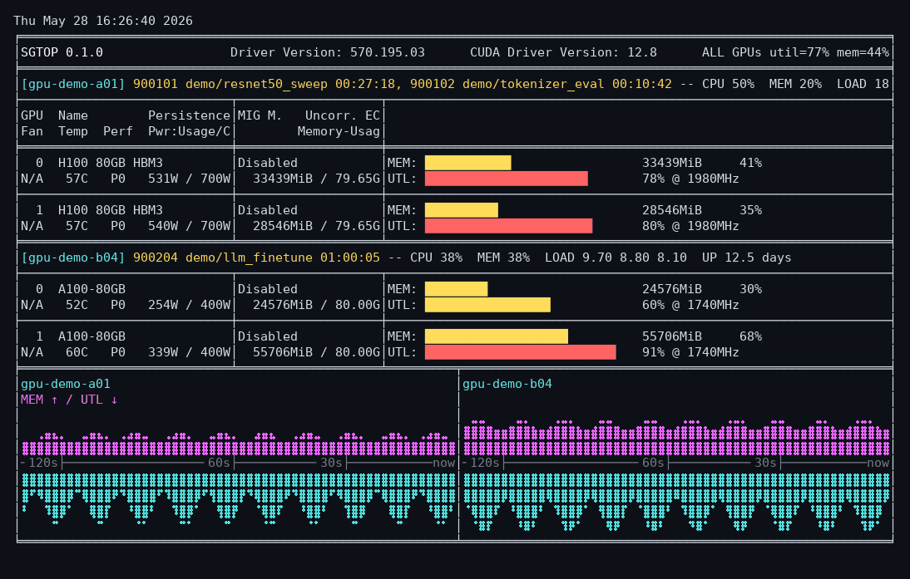

# slurm-nvtop

`sgtop` is a nvitop-like TUI for GPU Slurm jobs across all currently allocated
nodes. Run it from any node with Slurm client commands. It probes each job from
*inside* the job via `srun --overlap`, so it sees every job's GPUs correctly even
when several of your jobs share a node (where an SSH session could only ever land
in one job's cgroup).

## Install

```bash
uv tool install "git+ssh://git@github.com/Rock-Z/slurm-nvtop.git" && sgtop
```

One-off without installing:

```bash
uvx --from "git+ssh://git@github.com/Rock-Z/slurm-nvtop.git" sgtop
```

Local development:

```bash
uv run sgtop --mock-json tests/fixtures/sample_snapshot.json --color never
```

## Usage

```bash
sgtop                  # live dashboard; press q to quit
sgtop --once           # print one snapshot
sgtop --interval 5     # refresh every 5 seconds
sgtop --all-users      # show all visible GPU jobs
sgtop --no-unicode     # ASCII fallback
```

## Demo



## Requirements

- `uv` for install/run
- Slurm commands: `squeue`, ideally `scontrol`, and `srun`
- Permission to launch `srun --overlap` steps in your own running jobs
- `nvidia-smi` on the compute nodes

`sgtop` re-discovers jobs every refresh, probes each job in its own cgroup so it
sees every job even when several share a node, keeps probe errors visible, and
does not depend on cluster-specific node names, SSH access, or queue wrapper
scripts.
